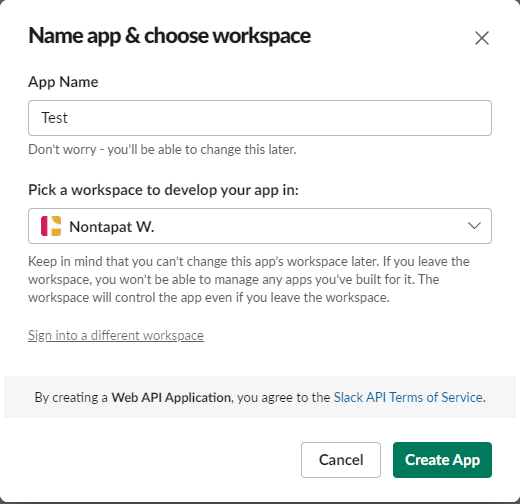
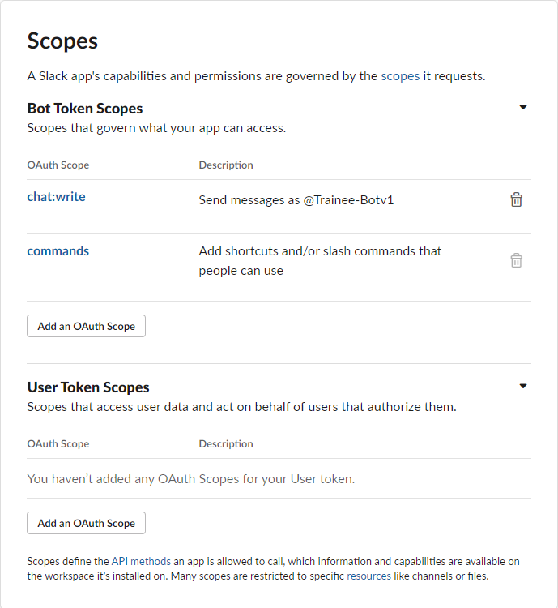
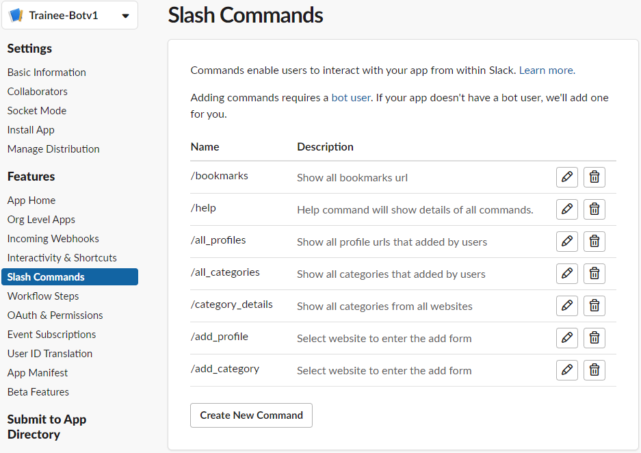
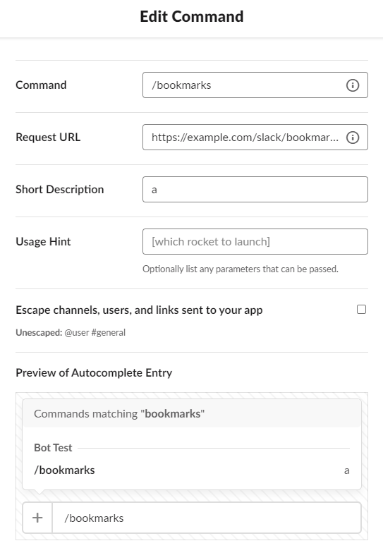

# NewsBot

Hi!, This project was developed as part of a training program. As a trainee, the developer aimed to enhance their skills in Python programming, web scraping, and bot development. NewsBot serves as a demonstration of their abilities to create a functional tool that integrates with Slack to deliver daily news updates.

*NewsBot* is a Slack bot that helps to update news from various websites, allowing users to receive the latest news daily and conveniently through Slack communication channels.

## Installation

1. **Set up the bot in Slack:** Create a bot in Slack and obtain the API token for usage.

3. **Install on your server:** Download the NewsBot code and install necessary dependencies.
4. **Configure settings:** Enter the Slack token obtained in step 1 and configure other settings as needed.
5. **Run the bot:** Start using NewsBot on your server.

## Usage

1. **Call NewsBot:** Simply mention the name of the bot in Slack and invoke various commands.
2. **Receive information:** Use predefined commands to receive news data from desired websites.

## Example

- `/news headlines`: Get the latest headlines.
- `/news tech`: Get technology news.
- `/news sports`: Get sports news.

## System Requirements

- Python 3.x
- Dependencies: [SlackClient](https://github.com/slackapi/python-slackclient), [Beautiful Soup](https://www.crummy.com/software/BeautifulSoup/bs4/doc/)

## Conclusion

Thank you for using *NewsBot*! If you have any questions or suggestions, please contact us at [email or other contact channels].
